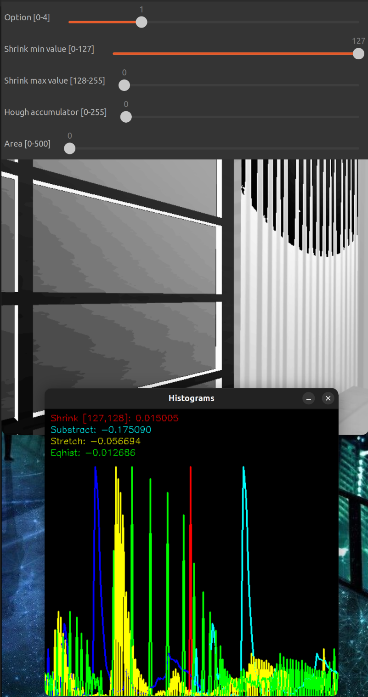

[](https://classroom.github.com/a/ixoJ3y_C)
# Computer Vision Examples


[](https://github.com/jmguerreroh/computer_vision/actions/workflows/master.yaml)

This project contains code examples created in Visual Studio Code for Computer Vision using C++ & OpenCV & Point Cloud Library (PCL) in ROS 2. These examples are created for the Computer Vision Subject of Robotics Software Engineering Degree at URJC.

This package is recommended to use with the [TIAGO](https://github.com/jmguerreroh/tiago_simulator) simulator.

## Exercise 3 Video
[Link_to_video.mp4](https://drive.google.com/file/d/15NIynJxYtdAGjDB31UIq1Ajo-4wTLSkU/view?usp=sharing)

Otro video se puede encontrar [aquí](img/practice.webm).

## Preguntas

1. Adjunta una captura de los histogramas obtenidos en la opción 1 cuando los valores
mínimo y máximo de la contracción son 125 y 126 respectivamente, y explica
brevemente el comportamiento de cada histograma en dicha imagen.




2. ¿Es posible acotar la dirección de las líneas detectadas en la transformada de Hough?
En caso afirmativo, ¿cómo? Justifique la/s respuesta/s.

Si es posible acotar la dirección de las líneas detectadas en la transformada de Hough con el ángulo theta:

```cpp
float theta = lines[i][1];
```

Por ejemplo si queremos obtener la líneas que son aproximadamente verticales podemos usar el siguiente if dentro del bucle:

```cpp
  // Draw the lines
  for (size_t i = 0; i < lines.size(); i++) {
    float rho = lines[i][0], theta = lines[i][1];
    if (theta > 0.5 || theta < -0.5) continue; // Este
    cv::Point pt1, pt2;
    double a = std::cos(theta), b = std::sin(theta);
    double x0 = a * rho, y0 = b * rho;
    pt1.x = cvRound(x0 + 1000 * (-b));
    pt1.y = cvRound(y0 + 1000 * ( a));
    pt2.x = cvRound(x0 - 1000 * (-b));
    pt2.y = cvRound(y0 - 1000 * ( a));
    cv::line(out_image_rgb, pt1, pt2, cv::Scalar(0, 0, 255), 3, cv::LINE_AA);
  }
```

O si queremos las horizontales:

```cpp
if (theta < 1.2 || theta > 1.8) continue;
```

Siempre hay que tener en cuenta que theta esta en radianes, por lo tanto 90º son 1.57.

# Installation 

You need to have previously installed ROS 2. Please follow this [guide](https://docs.ros.org/en/humble/Installation.html) if you don't have it.
```bash
source /opt/ros/humble/setup.bash
```

Clone the repository to your workspace:
```bash
mkdir -p ~/cv_ws/src
cd ~/cv_ws/src/
git clone https://github.com/jmguerreroh/tiago_simulator.git
cd ~/cv_ws/
rosdep install --from-paths src --ignore-src -r -y
```

# Building project

```bash
colcon build --symlink-install --cmake-args -DBUILD_TESTING=OFF
``` 
# Run

Execute:
```bash
ros2 launch computer_vision cv.launch.py
```
If you want to use your own robot, in the launcher, change the topic names to match the robot topics.

## FAQs:

* /usr/bin/ld shows libraries conflicts between two versions:

Probably you have installed and built your own OpenCV version, rename your local folder:
```bash
mv /usr/local/lib/cmake/opencv4 /usr/local/lib/cmake/oldopencv4
```

## About

This is a project made by [José Miguel Guerrero], Associate Professor at [Universidad Rey Juan Carlos].

Copyright &copy; 2024.

[](https://twitter.com/jm__guerrero)

## License

Shield: 

[![CC BY-SA 4.0][cc-by-sa-shield]][cc-by-sa]

This work is licensed under a
[Creative Commons Attribution-ShareAlike 4.0 International License][cc-by-sa].

[![CC BY-SA 4.0][cc-by-sa-image]][cc-by-sa]

[cc-by-sa]: http://creativecommons.org/licenses/by-sa/4.0/
[cc-by-sa-image]: https://licensebuttons.net/l/by-sa/4.0/88x31.png
[cc-by-sa-shield]: https://img.shields.io/badge/License-CC%20BY--SA%204.0-lightgrey.svg

[Universidad Rey Juan Carlos]: https://www.urjc.es/
[José Miguel Guerrero]: https://sites.google.com/view/jmguerrero
